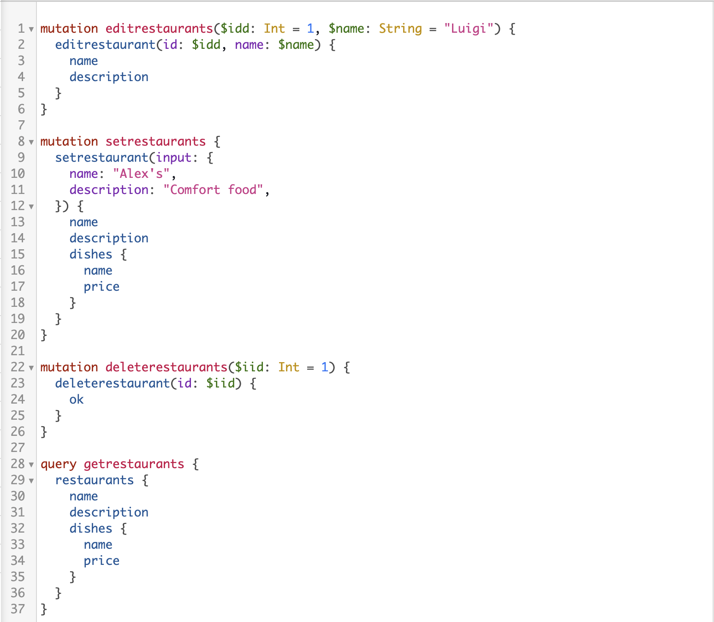

# Restaurant_GraphQL
Data Queries with GraphQL on Resturant Data

## Description
This project is an example of using GraphQL to implement C.R.U.D. The indexRestSoln.js file has data by the name of restaurant which can be manipulated using GraphQL mutations. 

## Installation 
Download a copy of this repo. Open the repo in your favorite code editor and terminal to the project's directory. Now you are ready to run 'npm install' to install the needed dependencies. 

### `nodemon indexRestSoln.js`

nodemon will open up a live server .\
Open [http://localhost:5500/graphql](http://localhost:5500/graphql) to view it in the browser.

## Usage
This project is an example of simple GraphQL methods. 

## Support
You can learn more in about [GraphQL here](https://graphql.org).\
[MDN Web Docs](https://developer.mozilla.org/en-US/docs/Web/JavaScript)

## License Information
MIT
